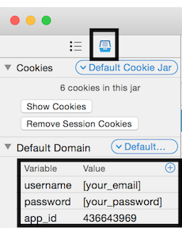

<h3 align="center">
  <a href="https://github.com/KrauseFx/fastlane">
    
     
    fastlane
  </a>
</h3>

  <a href="https://github.com/KrauseFx/deliver">deliver</a> &bull; 
  <a href="https://github.com/KrauseFx/snapshot">snapshot</a> &bull; 
  <a href="https://github.com/KrauseFx/frameit">frameit</a> &bull; 
  <a href="https://github.com/KrauseFx/PEM">PEM</a> &bull; 
  <a href="https://github.com/KrauseFx/sigh">sigh</a> &bull; 
  <a href="https://github.com/KrauseFx/produce">produce</a> &bull; 
  <a href="https://github.com/KrauseFx/cert">cert</a> &bull; 
  <a href="https://github.com/KrauseFx/codes">codes</a>

-------

itc-api-docs
============

###### The unofficial documentation of the iTunes Connect JSON API

Get in contact with the developer on Twitter: [@KrauseFx](https://twitter.com/KrauseFx)

# Introduction

This document describes the iTunes Connect JSON API and how to use it. The API is used by the AngularJS based iTunes Connect front-end to update app metadata. It is public once you have a valid session.

To test your requests, I recommend the awesome [Paw](https://luckymarmot.com/paw) HTTP Client for Mac OS.

### Cookies

All requests (except for the login action) require you to pass cookies. If you're using a HTTP client, you'll get this for free. 

# Testing/Using the API

Download the pre-filled [PAW file](https://github.com/fastlane/itc-api-docs/blob/master/assets/PublicPawFile.zip?raw=1) and open it with [Paw](https://luckymarmot.com/paw).

Next, you can enter your iTunes Connect credentials in the `Default Domain` settings: 

Switch back to the list of requests on the left side and select `Login`. Click `CMD` + `R` to send the request to login.

# API Docs

## Login

For all requests listed below, you'll need a valid cookie which you have to pass for each request.

**POST**

    https://itunesconnect.apple.com/WebObjects/iTunesConnect.woa/wo/0.0.1.11.3.15.2.1.1.3.1.1

**Available parameters**

- **theAccountName** (POST): Your Apple ID
- **theAccountPW** (POST): Your password

##### [Example response](examples/login.md)

## List Apps

List all your apps with the most basic app metadata:

**GET**

    https://itunesconnect.apple.com/WebObjects/iTunesConnect.woa/ra/apps/manageyourapps/summary

##### [Example response](examples/summary.md)

## Fetch App Information

Receive all metadata information available for this app, including app description, screenshots, review status and much more.

**GET**

    https://itunesconnect.apple.com/WebObjects/iTunesConnect.woa/ra/apps/version/[app_id]

**Available parameters**

- **App ID** (GET): The ID of your app (e.g. 903020700)
- **v** (GET): Defines if the app metadata of the version currently available in the App Store or the new version should be used.

**Example:**

    https://itunesconnect.apple.com/WebObjects/iTunesConnect.woa/ra/apps/version/[app_id]?v=live

This will fetch the app metadata from the version, that is currently available in the App Store. If you don't define this parameter, you receive the metadata from the version that is currently being edited.
Usually you don't need this parameter.

##### [Example response](examples/details.md)

## Update App Information

You can update the app metadata using this request. It's not very easy to build the request, as there are many parameters required. 

To upload screenshots it's recommended to use the `iTMSTransporter`, which is also used by [deliver](https://github.com/KrauseFx/deliver).

**POST**

    https://itunesconnect.apple.com/WebObjects/iTunesConnect.woa/ra/apps/version/save/[app_id]

**Available parameters**

[See example POST Request](examples/update_request.md) (quite complex)

##### [Example response](examples/update.md)

## Create a new App Version

Create a new version of your existing app.

**POST**

    https://itunesconnect.apple.com/WebObjects/iTunesConnect.woa/ra/apps/version/create/[app_id]

**Available parameters**

- **App ID** (GET): The ID of your app (e.g. 903020700) *GET*
- **JSON** (POST): `{"version": "2.0"}`

##### [Example response](examples/new_version.md)

## Upload a new binary

Uploading a new binary is only possible using the `iTMSTransporter`. You can take a look at [deliver](https://github.com/KrauseFx/deliver) how this is implemented. 

# Thanks

Special thanks to [this GitHub Issue](https://github.com/kovpas/itc.cli/issues/38) in particular @spidfire and [Christian Beer](https://twitter.com/christian_beer).